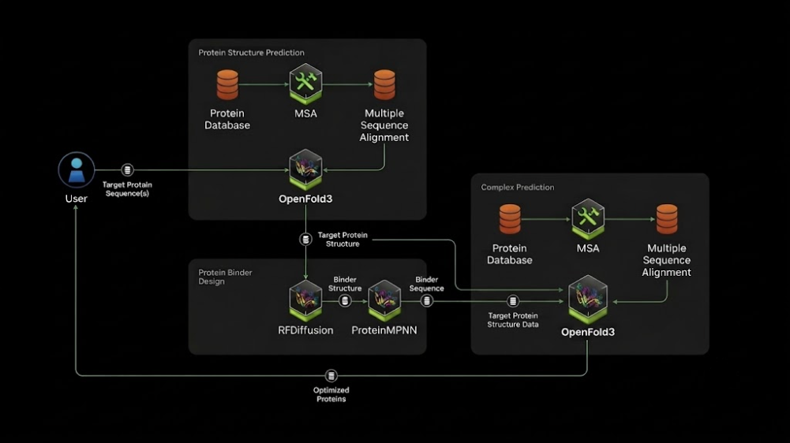

# NVIDIA BioNeMo Blueprint: Protein Binder Design



The NVIDIA BioNeMo Blueprint for protein binder design shows how generative AI and accelerated NIM microservices can be used to design binders to a target protein sequence smarter and faster. This workflow simplifies the process of _in silico_ protein binder design by automatically generating binder sequences and predicted structures for the binder and target.

This Blueprint takes as input a valid amino acid protein sequence. It utilizes the following models:

- **OpenFold3**: An all-atom biomolecular complex structure prediction model (PyTorch implementation of AlphaFold3) that predicts single-chain and multi-chain protein structures, as well as protein complexes with DNA, RNA, and ligands.
- **ProteinMPNN**: a deep learning model for predicting amino acid sequences for protein backbones.
- **RFDiffusion**: a generative model of protein backbones for protein binder design.

Once completed, this Blueprint outputs predicted multimer structures (in PDB format) for the target protein sequence and any generated peptide binders. These binder-target multimeric structures can then be assessed to find binders that effectively bind the target protein.

## System Requirements

The docker compose setup for this NIM Agent Blueprint requires the following specifications:
- At least 100 GB of fast NVMe SSD space
- A modern CPU with at least 24 CPU cores
- At least 64 GB of RAM
- Three or more NVIDIA L40s, A100, or H100 GPUs

## Get Started

- [Deploy with Docker Compose](deploy)
- [Deploy with Helm](protein-design-chart)
- [Source code](src)

## Quick Start
Deploy the blueprint using [Docker Compose](deploy) or [Helm](protein-design-chart)
```bash
cd ./src
jupyter notebook
```

## Set Up With Docker Compose

Navigate to the [deploy](deploy) directory to learn how to start up the NIMs.

## Set up with Helm

Follow the instructions in the [protein-design-chart](protein-design-chart) directory and deploy the Helm chart

## Notebook

An example of how to call each protein binder design step is located in [src/protein-binder-design.ipynb](src/protein-binder-design.ipynb)
